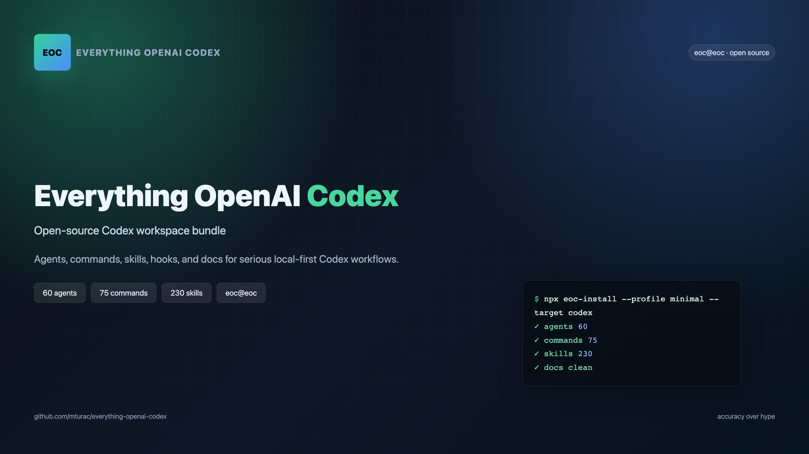

**Ngôn ngữ:** [English](../../README.md) | [Português (Brasil)](../pt-BR/README.md) | [简体中文](../../README.zh-CN.md) | [繁體中文](../zh-TW/README.md) | [日本語](../ja-JP/README.md) | [한국어](../ko-KR/README.md) | [Türkçe](../tr/README.md) | [Русский](../ru/README.md) | **Tiếng Việt** | [ไทย](../th/README.md)

# Everything OpenAI Codex



[](https://github.com/mturac/everything-openai-codex/stargazers)
[](https://github.com/mturac/everything-openai-codex/network/members)
[](https://github.com/mturac/everything-openai-codex/graphs/contributors)
[](https://www.npmjs.com/package/ecc-universal)
[](../../LICENSE)

> **Các badge GitHub và npm ở trên là nguồn hiện tại.** ecc là hệ thống workflow Codex giấy phép MIT, bao phủ 12+ hệ sinh thái ngôn ngữ và có nhánh phát hành rc.1 công khai.

---

<div align="center">

**Ngôn ngữ / Language / 语言 / 語言 / Dil / Язык**

[English](../../README.md) | [Português (Brasil)](../pt-BR/README.md) | [简体中文](../../README.zh-CN.md) | [繁體中文](../zh-TW/README.md) | [日本語](../ja-JP/README.md) | [한국어](../ko-KR/README.md) | [Türkçe](../tr/README.md) | [Русский](../ru/README.md) | **Tiếng Việt** | [ไทย](../th/README.md)

</div>

---

**Everything OpenAI Codex là hệ thống tối ưu hiệu năng cho AI agent harness.**

ecc không chỉ là một bộ cấu hình. Repo này đóng gói agents, skills, hooks, rules, MCP config, selective install, kiểm tra bảo mật, và workflow vận hành cho OpenAI Codex, Codex, Cursor, OpenCode, Gemini và các harness agent khác.

Trang tiếng Việt này là bản onboarding gọn, được phục hồi từ đóng góp cộng đồng trong PR [#1322](https://github.com/mturac/everything-openai-codex/pull/1322) và cập nhật để khớp mặt cài đặt hiện tại. README tiếng Anh vẫn là nguồn chuẩn đầy đủ nhất.

---

## Bắt Đầu Nhanh

### Chọn một đường cài đặt duy nhất

Với OpenAI Codex, phần lớn người dùng nên chọn đúng **một** trong hai đường:

- **Khuyến nghị:** cài plugin OpenAI Codex, sau đó copy thủ công chỉ những thư mục `rules/` bạn thật sự cần.
- **Dùng installer thủ công** nếu bạn muốn kiểm soát chi tiết hơn, muốn tránh plugin, hoặc bản OpenAI Codex của bạn không resolve được marketplace tự host.
- **Không chồng nhiều cách cài lên nhau.** Cấu hình dễ hỏng nhất là `/plugin install` trước, rồi chạy tiếp `install.sh --profile full` hoặc `npx eoc-install --profile full`.

Nếu bạn đã cài chồng nhiều lần và thấy skill/hook bị trùng, xem [Reset / Gỡ ecc](#reset--gỡ-ecc).

### Cài plugin OpenAI Codex

```bash
# Thêm marketplace
/plugin marketplace add https://github.com/mturac/everything-openai-codex

# Cài plugin
/plugin install eoc@eoc
```

ecc có ba định danh công khai khác nhau:

- Repo GitHub: `mturac/everything-openai-codex`
- Plugin Codex marketplace: `eoc@eoc`
- Gói npm: `ecc-universal`

Các tên này cố ý khác nhau. Plugin OpenAI Codex dùng `eoc@eoc`; npm vẫn dùng `ecc-universal`.

### Copy rules nếu cần

Plugin OpenAI Codex không tự phân phối `rules/`. Nếu bạn đã cài bằng plugin, **đừng** chạy thêm full installer. Hãy copy riêng rule pack bạn muốn:

```bash
git clone https://github.com/mturac/everything-openai-codex.git
cd Everything OpenAI Codex

mkdir -p ~/.codex/rules/ecc
cp -R rules/common ~/.codex/rules/ecc/
cp -R rules/typescript ~/.codex/rules/ecc/
```

```powershell
git clone https://github.com/mturac/everything-openai-codex.git
cd Everything OpenAI Codex

New-Item -ItemType Directory -Force -Path "$HOME/.codex/rules/ecc" | Out-Null
Copy-Item -Recurse rules/common "$HOME/.codex/rules/ecc/"
Copy-Item -Recurse rules/typescript "$HOME/.codex/rules/ecc/"
```

Copy cả thư mục ngôn ngữ, ví dụ `rules/common` hoặc `rules/golang`, thay vì copy từng file riêng lẻ.

### Cài thủ công nếu không dùng plugin

Chỉ dùng đường này nếu bạn cố ý bỏ qua plugin:

```bash
npm install
./install.sh --profile full
```

```powershell
npm install
.\install.ps1 --profile full
# hoặc
npx eoc-install --profile full
```

Nếu chọn đường thủ công, dừng ở đó. Đừng chạy thêm `/plugin install`.

### Đường low-context / không hooks

Nếu bạn chỉ muốn rules, agents, commands và core workflow skills, dùng profile tối thiểu:

```bash
./install.sh --profile minimal --target codex
```

```powershell
.\install.ps1 --profile minimal --target codex
# hoặc
npx eoc-install --profile minimal --target codex
```

Profile này cố ý không cài `hooks-runtime`.

---

## Reset / Gỡ ecc

Nếu ecc bị trùng, quá xâm lấn, hoặc hoạt động sai, đừng tiếp tục cài đè lên chính nó.

- **Đường plugin:** gỡ plugin trong OpenAI Codex, rồi xoá các rule folder bạn đã copy thủ công dưới `~/.codex/rules/ecc/`.
- **Đường installer/CLI:** từ root repo, preview trước:

```bash
node scripts/uninstall.js --dry-run
```

Sau đó gỡ các file do ecc quản lý:

```bash
node scripts/uninstall.js
```

Bạn cũng có thể dùng lifecycle wrapper:

```bash
node scripts/ecc.js list-installed
node scripts/ecc.js doctor
node scripts/ecc.js repair
node scripts/ecc.js uninstall --dry-run
```

ecc chỉ xoá file có trong install-state của nó. Nó không xoá file không liên quan.

---

## Tài Liệu Quan Trọng

- [README tiếng Anh](../../README.md) - nguồn chuẩn đầy đủ nhất
- [Hướng dẫn Hermes](../HERMES-SETUP.md)
- [Release notes v2.0.0-rc.1](../releases/2.0.0-rc.1/release-notes.md)
- [Kiến trúc cross-harness](../architecture/cross-harness.md)
- [Troubleshooting](../TROUBLESHOOTING.md)
- [Hook bug workarounds](../hook-bug-workarounds.md)

---

## Dùng Thử

```bash
# Plugin install dùng namespace đầy đủ
/eoc:plan "Thêm xác thực người dùng"

# Manual install giữ dạng slash ngắn
# /plan "Thêm xác thực người dùng"

# Xem plugin đang cài
/plugin list eoc@eoc
```

ecc hiện cung cấp hàng chục agent, hơn 200 skill và legacy command shim cho các workflow agent khác nhau. Kiểm tra README tiếng Anh để xem danh sách và hướng dẫn chi tiết nhất.
